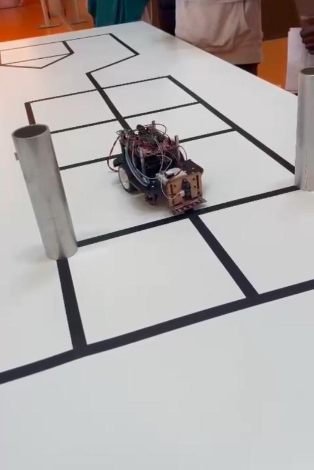

# Autonomous Line-Following Robot

## Project Description
This project consists of developing the complete code for an autonomous robot capable of following a predefined track on a table using a black tape, handling obstacles, and reacting to direction choices indicated by the evaluator through buttons. The system is based on an **ATmega324PA** microcontroller and integrates various sensors (infrared, line follower) as well as control modules (bi-color LED, PWM, timers, CAN bus, etc.).

We scored **96%** on the final robot challenge and earned an **A** in the course — a result achieved by only a small number of teams, as most do not complete the entire challenge.

---

[Watch the robot in action](robot_demo.mp4)

---

## Code Organization and Repository Structure
- **lib/** – Contains all the classes and library modules (management of CAN bus, LED, motors, sensors, etc.).
- **app/** – Groups the main application code (overall robot control, localization, track interpretation, `main.cpp`, etc.).

Each file includes a header specifying the authors, a concise description of its role, and the necessary hardware details (for example, the pins used).

---

## Compilation and Usage Instructions
- The code is compiled with **AVR-GCC** using a defined frequency (`F_CPU = 8 MHz`).
- Use the `make` command (or follow the detailed instructions in *PF_Explications.pdf*) to generate the binary for the microcontroller.
- After compilation, upload the code to the robot using your usual tool (e.g., `avrdude`).

---

## Expected Robot Behavior
1. Before starting, the evaluator selects the directions to take at points **B** and **C** by pressing the buttons:
   - White button → left turn (LED shows **red**)
   - Interrupt button → right turn (LED shows **green**)
2. Once the choice is made and after a 2-second delay, the robot starts and follows the track while adapting its behavior to obstacles (bifurcations, pole detection, gate crossing, etc.).
3. At the end of the track, the robot returns to its initial position, and the LED blinks alternately **red and green at 2 Hz** to signal a complete stop.

---

*This project was carried out as part of the course **INF1900 – Initial Embedded System Project** at **Polytechnique Montréal**.*
